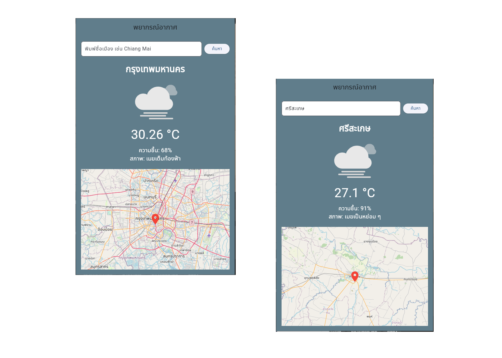

# Flutter weathermap api

## พัฒนาโดย 

สมาชิก

นายจักรภัทร หอมกระจาย 6612732106

นายนันทพัฒท์ นามคุณ 66127321116

นายปวเรศ ใจธรรม 6612732120

นายรัชชานนท์ ทองแดงดี 6612732124

สาขาวิทยาการคอมพิวเตอร์, คณะศิลปศาสตร์และวิทยาศาสตร์ มหาวิทยาลัยราชภัฏศรีสะเกษ

**Description:**

Weather App - แอปพยากรณ์อากาศ

คำอธิบาย:

แอป Weather App เป็นแอปพลิเคชันสำหรับ ดูพยากรณ์อากาศ ของเมืองต่าง ๆ โดยดึงข้อมูลจาก OpenWeatherMap API พร้อมแสดงสถานะอากาศ, อุณหภูมิ, ความชื้น และตำแหน่งบนแผนที่

แอปนี้พัฒนาขึ้นเพื่อใช้เป็น ตัวอย่างการเรียนการสอน Flutter และการใช้งาน API, JSON, การจัดการ State และการแสดงผลข้อมูลบนมือถือ

## ฟีเจอร์ของแอป

ค้นหาเมือง

กรอกชื่อเมืองในช่องค้นหา

กดปุ่ม ค้นหา เพื่อดูสภาพอากาศปัจจุบัน

แสดงข้อมูลสภาพอากาศ

ชื่อเมือง

อุณหภูมิ (°C)

ความชื้น (%)

สภาพอากาศโดยรวม (เช่น แจ่มใส, มีเมฆ, ฝนตก)

แสดง Animation ตามสภาพอากาศ

แผนที่ตำแหน่งเมือง

แสดงตำแหน่งของเมืองบน OpenStreetMap

แสดง Marker ที่ตำแหน่งเมือง

รองรับ Loading และ Error Handling

แสดง Loading Indicator ขณะดึงข้อมูล

หากไม่พบข้อมูล หรือเกิดข้อผิดพลาด จะแจ้งข้อความให้ผู้ใช้

## ตัวอย่างหน้าจอ User Interface

